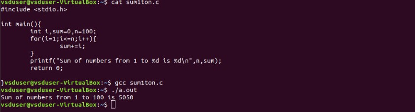
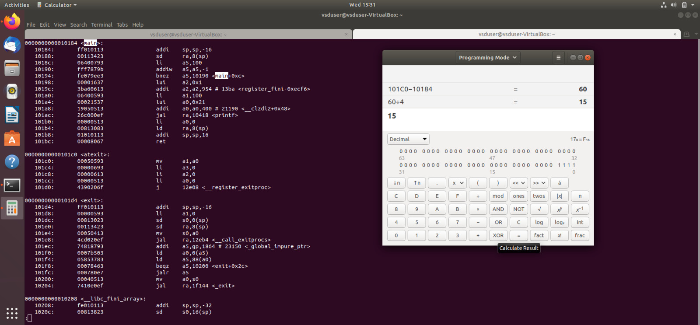
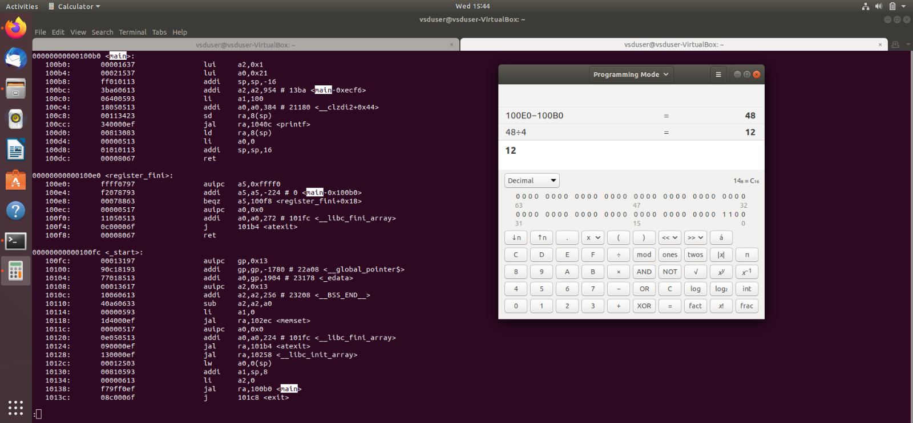

# ASIC_DESIGN
<details>
 <summary><strong>Lab1</strong></summary>
 
 ### Description
   In this lab we compile a simple C program using GCC and RISCV compliers.
 ### Tasks
1.  Writing a simple C program to calculate sum of n numbers and execute the program using GCC.
2.  Execute the same C program using RISCV compiler and compare the results.
## Procedure
 ### Task-1
1. Create a new file(sum1ton.c) in home directory.(Run the command 'cd' before creating the file to make sure you are in home directory).
2. We use leafpad as texteditor to write the code.
   ### Code
   ```c
   #include <stdio.h>
   int main(){
     int i,sum=0,n=100;
     for(i=1;i<=n;i++){
       sum+=i;
     }
     printf("Sum of numbers from 1 to %d is %d\n",n,sum);
     return 0;
   }
   ```
   ### To compile the code using GCC
   ```
   gcc sum1ton.c
   ```

   ### To Run the code
   ```
   ./a.out
   ```
   ### Output
   
### Task-2 : Compliling and verifying the same C code using RISC-V compiler
  1. Compile the code using RISV using the below command
     ```
     riscv64-unknown-elf-gcc -O1 -mabi=lp64 -march=rv64i -o sum1ton.o sum1ton.c
     ```
  2. To run the code
     ```
     riscv64-unknown-elf-objdump -d sum1ton.o | less
     ```
  3. Output
     
  ### Explanation of the Output:
  - 0000000000010184 is the address where the main function starts.
  - To known the number of instructions it takes to execute we subtract 0000000000010184(which is the next function) from 00000000000101c0 and divide it by 4(Since each instruction takes 4 bytes).
  - In this case it take 15 instructions.
  - We can reduce the number of instructions it takes by compiling the code using the below command.
     ```
     riscv64-unknown-elf-gcc -Ofast -mabi=lp64 -march=rv64i -o sum1ton.o sum1ton.c
     ```
     
    - Run the code using the same code as above.
    - In the above case it is taking only 12 instructions to execute.

</details>
<details>
 <summary><strong>Lab2</strong></summary>

  ### Description
  Comparing the GCC compiled output with RISCV compiled output
  ### Procedure
  1. Compile the code using the below command.
     ```
     riscv64-unknown-elf-gcc -Ofast -mabi=lp64 -march=rv64i -o sum1ton.o sum1ton.c
     ```
  2. Run the code
     ```
     spike pk sum1ton.o
     ```
  3. Output
     
</details>
 
  
     

   
   
