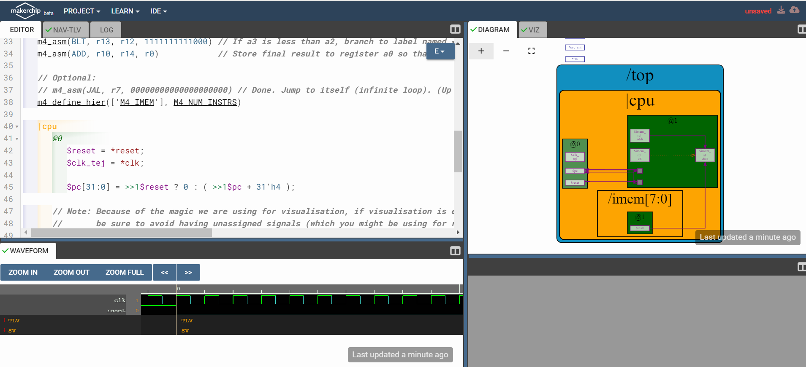
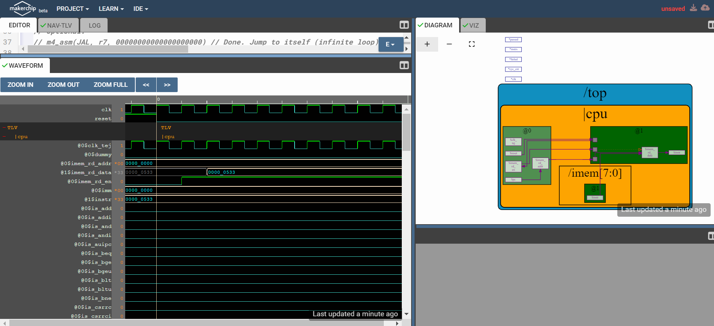
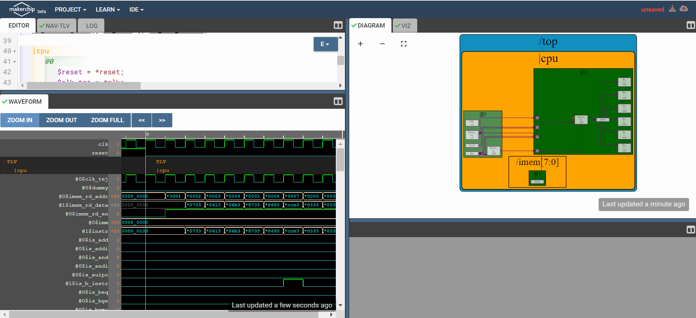
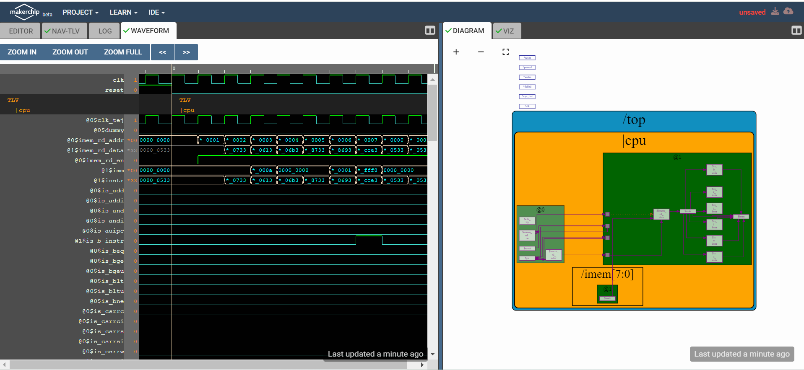

# ASIC_DESIGN
<details>
 <summary><strong>Lab-1</strong></summary>
 
 ### Description
   In this lab we compile a simple C program using GCC and RISCV compliers.
 ### Tasks
1.  Writing a simple C program to calculate sum of n numbers and execute the program using GCC.
2.  Execute the same C program using RISCV compiler and compare the results.
## Procedure
 ### Task-1
1. Create a new file(sum1ton.c) in home directory.(Run the command 'cd' before creating the file to make sure you are in home directory).
2. We use leafpad as texteditor to write the code.
   ### Code
   ```c
   #include <stdio.h>
   int main(){
     int i,sum=0,n=100;
     for(i=1;i<=n;i++){
       sum+=i;
     }
     printf("Sum of numbers from 1 to %d is %d\n",n,sum);
     return 0;
   }
   ```
   ### To compile the code using GCC
   ```
   gcc sum1ton.c
   ```

   ### To Run the code
   ```
   ./a.out
   ```
   ### Output
   
### Task-2 : Compliling and verifying the same C code using RISC-V compiler
  1. Compile the code using RISV using the below command
     ```
     riscv64-unknown-elf-gcc -O1 -mabi=lp64 -march=rv64i -o sum1ton.o sum1ton.c
     ```
  2. To run the code
     ```
     riscv64-unknown-elf-objdump -d sum1ton.o | less
     ```
  3. Output
     
  ### Explanation of the Output:
  - 0000000000010184 is the address where the main function starts.
  - To known the number of instructions it takes to execute we subtract 0000000000010184(which is the next function) from 00000000000101c0 and divide it by 4(Since each instruction takes 4 bytes).
  - In this case it take 15 instructions.
  - We can reduce the number of instructions it takes by compiling the code using the below command.
     ```
     riscv64-unknown-elf-gcc -Ofast -mabi=lp64 -march=rv64i -o sum1ton.o sum1ton.c
     ```
     
    - Run the code using the same code as above.
    - In the above case it is taking only 12 instructions to execute.

</details>


<details>
 <summary><strong>Lab-2</strong></summary>

  ### Description
  Comparing the GCC compiled output with RISCV compiled output
  ### Procedure
  1. Compile the code using the below command.
     ```
     riscv64-unknown-elf-gcc -Ofast -mabi=lp64 -march=rv64i -o sum1ton.o sum1ton.c
     ```
  2. Run the code
     ```
     spike pk sum1ton.o
     ```
  3. Output
     
  ### Debugging the Code
  - We debug the code using the below command
    ```
    spike -d pk sum1ton.o
    ```
  - First run the RISCV code(`riscv64-unknown-elf-objdump -d sum1ton.o | less`).We can get the location of main function from where we can debug the code line by line.
    #### Output
    
    
  - Use the below command to take pc to the main function .(100b0 is the starting point of the main function).
    ```
    until pc 0 100b0
    ```
  - We can know the initial value of a2 before executing the instruction and obsereve the change in the value of a2 after executing the instruction.
  - To know the value of a2 use the below command.Press enter the run the following instructions.
     ```
     reg 0 a2
     ```
     
  - lui - Load Upper immediate.
  - We can observe the value of a2 is changed.
  - Similarily, we can also observe the working of the other RISCV instruction i.e addi
  - To observe the working of addi, first move the pc to 100b8(which means program is executed till the instruction 100b8).Then observe the change in the value of sp(-16 in decimal is 10 in hexadecimal).We can observe the value of sp is decreased by 10.
    
### References
[RISCV-INSTRUCTIONS](https://riscv.org/wp-content/uploads/2017/05/riscv-spec-v2.2.pdf) 
</details>


<details>
 <summary><strong>Lab-3</strong></summary>.

   ## Description
   To identify various RISC-V instruction type (R, I, S, B, U, J) and determine exact 32-bit instruction code in the instruction type format for below RISC-V instructions. 
   ## Theory
   - The RISC-V architecture employs six main instruction formats—R-Type, I-Type, S-Type, B-Type, U-Type, and J-Type—each used for specific operations like arithmetic, logic, immediate value processing, branching, memory access, and jumps respectively.
  - Instruction format for different RISC-V instructions:
  
  

- Instruction set table for predefined values:
  
  

     
      
   ## Instructions
   ```
    ADD r6, r7, r8
    SUB r8, r6, r7
    AND r7, r6, r8
    OR r8, r7, r5
    XOR r8, r6, r4
    SLT r10, r2, r4
    ADDI r12, r3, 5
    SW r3, r1, 4
    SRL r16, r11, r2
    BNE r0, r1, 20
    BEQ r0, r0, 15
    LW r13, r11, 2
    SLL r15, r11, r2
   ```
   ## Detailed Instruction Breakdown

  -  ```ADD r6, r7, r8```
     - **Opcode for ADD**: `0110011`
     - **rd** = `r6` = `00110`
     - **rs1** = `r7` = `00111`
     - **rs2** = `r8` = `01000`
     - **func3** = `000`
     - **func7** = `0000000`
     - **Instruction Type**: R Type
     - **32-bit Instruction**: `0000000_01000_00111_000_00110_0110011`
     - **Hexadecimal representation**: ` 0x00838333`
    
  -  ```SUB r8, r6, r7```
     - **Opcode for SUB**: `0110011`
     - **rd** = `r8` = `01000`
     - **rs1** = `r6` = `00110`
     - **rs2** = `r7` = `00111`
     - **func3** = `000`
     - **func7** = `0100000`
     - **Instruction Type**: R Type
     - **32-bit Instruction**: `0100000_00111_00110_000_01000_0110011`
     - **Hexadecimal representation**: `0x40730433`
    
  - ```AND r7, r6, r8```
    
     - **Opcode for AND**: `0110011`
     - **rd** = `r7` = `00111`
     - **rs1** = `r6` = `00110`
     - **rs2** = `r8` = `01000`
     - **func3** = `111`
     - **func7** = `0000000`
     - **Instruction Type**: R Type
     - **32-bit Instruction**: `0000000_01000_00110_111_00111_0110011`
     - **Hexadecimal representation**: `0x008373B3`
   
  - ```OR r8, r7, r5```
     - **Opcode for OR**: `0110011`
     - **rd** = `r8` = `01000`
     - **rs1** = `r7` = `00111`
     - **rs2** = `r5` = `00101`
     - **func3** = `110`
     - **func7** = `0000000`
     - **Instruction Type**: R Type
     - **32-bit Instruction**: `0000000_00101_00111_110_01000_0110011`
     - **Hexadecimal representation**: `0x0053E433`
   
  - ```XOR r8, r6, r4```
    - **Opcode for XOR**: `0110011`
    - **rd** = `r8` = `01000`
    - **rs1** = `r6` = `00110`
    - **rs2** = `r4` = `00100`
    - **func3** = `100`
    - **func7** = `0000000`
    - **Instruction Type**: R Type
    - **32-bit Instruction**: `0000000_00100_00110_100_01000_0110011`
    - **Hexadecimal representation**: `0x00434433`
   
  -  ```SLT r10, r2, r4```
     - **Opcode for SLT**: `0110011`
     - **rd** = `r10` = `01010`
     - **rs1** = `r2` = `00010`
     - **rs2** = `r4` = `00100`
     - **func3** = `010`
     - **func7** = `0000000`
     - **Instruction Type**: R Type
     - **32-bit Instruction**: `0000000_00100_00010_010_01010_0110011`
     - **Hexadecimal representation**: `0x00412533`
     
  - ```ADDI r12, r3, 5```
   
    - **Opcode for ADDI**: `0010011`
    - **rd** = `r12` = `01100`
    - **rs1** = `r3` = `00011`
    - **imm[11:0]** = `000000000101`
    - **func3** = `000`
    - **Instruction Type**: I Type
    - **32-bit Instruction**: `000000000101_00011_000_01100_0010011`
    - **Hexadecimal representation**: `0x00518613`
   
   - ```SW r3, r1, 4```
   
     - **Opcode for SW**: `0100011`
     - **imm[11:5]** = `0000000`
     - **rs2** = `r3` = `00011`
     - **rs1** = `r1` = `00001`
     - **imm[4:0]** = `00100`
     - **func3** = `010`
     - **Instruction Type**: S Type
     - **32-bit Instruction**: `0000000_00011_00001_010_00100_0100011`
     - **Hexadecimal representation**: `0x0030A223`
   
  - ```SRL r16, r11, r2```
   
    - **Opcode for SRL**: `0110011`
    - **rd** = `r16` = `10000`
    - **rs1** = `r11` = `01011`
    - **rs2** = `r2` = `00010`
    - **func3** = `101`
    - **func7** = `0000000`
    - **Instruction Type**: R Type
    - **32-bit Instruction**: `0000000_00010_01011_101_10000_0110011`
    - **Hexadecimal representation**: `0x0025D833`
   
  - ```BNE r0, r1, 20```
   
    - **Opcode for BNE**: `1100011`
    - **imm[12|10:5]** = `0000010`
    - **rs2** = `r1` = `00001`
    - **rs1** = `r0` = `00000`
    - **imm[4:1|11]** = `10100`
    - **func3** = `001`
    - **Instruction Type**: B Type
    - **32-bit Instruction**: `0000010_00001_00000_001_10100_1100011`
    - **Hexadecimal representation**: `0x04101A63`
   
  - ```BEQ r0, r0, 15```
   
    - **Opcode for BEQ**: `1100011`
    - **imm[12|10:5]** = `0000000`
    - **rs2** = `r0` = `00000`
    - **rs1** = `r0` = `00000`
    - **imm[4:1|11]** = `01111`
    - **func3** = `000`
    - **Instruction Type**: B Type
    - **32-bit Instruction**: `0000000_00000_00000_000_01111_1100011`
    - **Hexadecimal representation**: `0x000007E3`
   
  - ```LW r13, r11, 2```
   
    - **Opcode for LW**: `0000011`
    - **rd** = `r13` = `01101`
    - **rs1** = `r11` = `01011`
    - **imm[11:0]** = `000000000010`
    - **func3** = `010`
    - **Instruction Type**: I Type
    - **32-bit Instruction**: `000000000010_01011_010_01101_0000011`
    - **Hexadecimal representation**: `0x0025A683`
   
  - ```SLL r15, r11, r2```
    
    - **Opcode for SLL**: `0110011`
    - **rd** = `r15` = `01111`
    - **rs1** = `r11` = `01011`
    - **rs2** = `r2` = `00010`
    - **func3** = `001`
    - **func7** = `0000000`
    - **Instruction Type**: R Type
    - **32-bit Instruction**: `0000000_00010_01011_001_01111_0110011`
    - **Hexadecimal representation**: `0x002597B3`
 
 # RISC-V Instruction Summary Table


| Instruction        | Type | 32-bit Binary Representation         | Hexadecimal Representation |
|--------------------|------|--------------------------------------|----------------------------|
| `ADD r6, r7, r8`   | R    | `0000000_01000_00111_000_00110_0110011` | `0x00838333` |
| `SUB r8, r6, r7`   | R    | `0100000_00111_00110_000_01000_0110011` | `0x40730433` |
| `AND r7, r6, r8`   | R    | `0000000_01000_00110_111_00111_0110011` | `0x008373B3` |
| `OR r8, r7, r5`    | R    | `0000000_00101_00111_110_01000_0110011` | `0x0053E433` |
| `XOR r8, r6, r4`   | R    | `0000000_00100_00110_100_01000_0110011` | `0x00434433` |
| `SLT r10, r2, r4`  | R    | `0000000_00100_00010_010_01010_0110011` | `0x00412533` |
| `ADDI r12, r3, 5`  | I    | `000000000101_00011_000_01100_0010011` | `0x00518613` |
| `SW r3, r1, 4`     | S    | `0000000_00011_00001_010_00100_0100011` | `0x0030A223` |
| `SRL r16, r11, r2` | R    | `0000000_00010_01011_101_10000_0110011` | `0x0025D833` |
| `BNE r0, r1, 20`   | B    | `0000010_00001_00000_001_10100_1100011` | `0x04101A63` |
| `BEQ r0, r0, 15`   | B    | `0000000_00000_00000_000_01111_1100011` | `0x000007E3` |
| `LW r13, r11, 2`   | I    | `000000000010_01011_010_01101_0000011` | `0x0025A683` |
| `SLL r15, r11, r2` | R    | `0000000_00010_01011_001_01111_0110011` | `0x002597B3` |

</details>

<details>
<summary><strong>Lab-4</strong></summary>
 
 ## Description
 Functional simulation experiment
 ## Standard RISCV ISA AND Hardcoded ISA(based on given verilog code)
 - In the Verilog code, each instruction type is assigned a unique opcode, and the func3 and func7 fields have distinct values compared to the standard RISC-V values. The func7 field is primarily used to differentiate immediate operations from other arithmetic functions; if it’s not serving this purpose, func7 is set to b'0 in the Verilog implementation.
 - Below is the table with hardcoded 32-bit code using func3,func7 and opcodes from the given verilog code.

| S.No | Instruction        | Hardcoded 32-bit Pattern             | Hardcoded Hexadecimal Pattern | 32-bit Pattern                        | Hexadecimal Pattern |
|------|--------------------|--------------------------------------|--------------------------------|---------------------------------------|---------------------|
| 1    | ADD r6,r7,r8        | 0000001_01000_00111_000_00110_0000000 | 0x02838300                     |0000000_01000_00111_000_00110_0110011 | 0x00838333          |
| 2    | SUB r8,r6,r7        | 0000001_00111_00110_001_01000_0000000 | 0x02731400                    |0100000_00111_00110_000_01000_0110011 | 0x40730433         |
| 3    | AND r7, r6, r8      | 0000001_01000_00110_010_00111_0000000 | 0x02832380                     |0000000_01000_00110_111_00111_0110011 | 0x008373B3          |
| 4    | OR r8, r7, r5       | 0000001_00101_00111_011_01000_0000000 | 0x0253B400                     | 0000000_00101_00111_110_01000_0110011 | 0x0053E433          |
| 5    | XOR r8, r6, r4      | 0000001_00100_00110_100_01000_0000000 | 0x02434400                     | 0000000_00100_00110_100_01000_0110011 | 0x00434433          |
| 6    | SLT r10, r2, r4     | 0000001_00100_00010_101_01010_0000000 | 0x02415500                     | 0000000_00100_00010_010_01010_0110011 | 0x00412533          |
| 7    | ADDI r12, r3, 5     | 000000000101_00011_000_01100_0000000 | 0x00518600                     | 0000000_000101_00011_000_01100_0010011 | 0x00518613         |
| 8    | SW r3, r1, 4        | 0000000_00001_00011_001_00100_0000001 | 0x00119201                     | 0000000_00001_00011_010_00100_0100011 | 0x0030A223          |
| 9    | SRL r16, r11, 2      | 0000000_00010_01011_001_10000_0000011 | 0x00259803                      | 0000000_00010_01011_101_10000_0110011 | 0x0025D833          |
| 10   | BEQ r0, r0, 15    | 0_000000_01111_00000_000_0000_0_0000010 | 	0X00f00002                     | 0000000_00000_00000_000_01111_1100011 | 0x000007E3          |
| 11   | LW r13, r11, 2     |  000000000010_01011_000_01101_0000001|   	0x00258681                       |0000000_00010_01011_010_01101_0000011 |0x0025A683 |


## Instructions provided in the verilog code

| S. No. | Operation          | Standard RISC-V ISA | Hardcoded ISA |
|--------|--------------------|---------------------|---------------|
| 1      | ADD R6, R1, R2      | 0x00110333          | 0x02208300    |
| 2      | SUB R7, R1, R2      | 0x402083b3          | 0x02209380    |
| 3      | AND R8, R1, R3      | 0x0030f433          | 0x0230a400    |
| 4      | OR R9, R2, R5       | 0x005164b3          | 0x02513480    |
| 5      | XOR R10, R1, R4     | 0x0040c533          | 0x0240c500    |
| 6      | SLT R11, R2, R4     | 0x0045a0b3          | 0x02415580    |
| 7      | ADDI R12, R4, 5     | 0x004120b3          | 0x00520600    |
| 8      | BEQ R0, R0, 15      | 0x00000f63          | 0x00f00002    |
| 9      | SW R3, R1, 2        | 0x0030a123          | 0x00209181    |
| 10     | LW R13, R1, 2       | 0x0020a683          | 0x00208681    |
| 11     | BEQ R0, R0, 15      | 0x00000f63          | 0x00f00002    |
| 12     | ADD R14, R2, R2     | 0x00210733          | 0x00210700    |

## Below are the output waveforms for each instruction from testbench.
  ```1.  ADD r6, r1, r2 ```
   
   


   ```2. SUB r7, r1, r2 ```

   


   ```3.  AND r8, r1, r3 ```

   


   ```4. OR r9, r2, r5 ```

   


   ```5. XOR r10, r1, r4 ```

   

  ```6. SLT r11, r2, r4 ```

   


   ```7. ADDI r12, r4, 5 ```

   


   ```8. SW r3, r1, 2 ```

   


   ```9. LW r0, r0, 15 ```

   


   ```10. BEQ r0, r0, 15 ```

   


   ```11. ADD r14, r2, r2```
   
   

   The final output plot is :

   


</details>
 
<details>
 <summary><strong>Lab-5</strong></summary>
 
 ### Description
   We compile a C program using GCC and RISCV compliers.
 ### Tasks
1.  This C program simulates a basic vending machine. It allows a user to display available items, purchase an item by selecting it from the menu, and handle transactions, including calculating the total cost and change. It uses a menu-driven interface to interact with the user.
2. Compile the program using GCC.
3.  Execute the same C program using RISCV compiler and compare the results.
### Procedure
 ### Code
 ```c
#include <stdio.h>

#define MAX_ITEMS 5

typedef struct {
    char name[30];
    double price;
    int quantity;
} Item;

void display_items(Item items[], int num_items);
void purchase_item(Item items[], int num_items);

int main() {
    Item items[MAX_ITEMS] = {
        {"Soda", 1.25, 10},
        {"Chips", 1.00, 15},
        {"Candy", 0.75, 20},
        {"Water", 1.50, 10},
        {"Juice", 1.75, 8}
    };

    int choice;

    while (1) {
        printf("\nVending Machine\n");
        printf("-----------------\n");
        printf("1. Display Items\n");
        printf("2. Purchase Item\n");
        printf("3. Exit\n");
        printf("Enter your choice: ");
        scanf("%d", &choice);

        switch (choice) {
            case 1:
                display_items(items, MAX_ITEMS);
                break;
            case 2:
                purchase_item(items, MAX_ITEMS);
                break;
            case 3:
                printf("Exiting...\n");
                return 0;
            default:
                printf("Invalid choice. Please try again.\n");
        }
    }

    return 0;
}

void display_items(Item items[], int num_items) {
    printf("\nAvailable Items:\n");
    printf("ID\tName\tPrice\tQuantity\n");
    printf("----------------------------------\n");

    for (int i = 0; i < num_items; i++) {
        printf("%d\t%s\t$%.2f\t%d\n", i + 1, items[i].name, items[i].price, items[i].quantity);
    }
}

void purchase_item(Item items[], int num_items) {
    int item_id;
    int quantity;
    double payment;

    printf("Enter the item ID you want to purchase: ");
    scanf("%d", &item_id);

    if (item_id < 1 || item_id > num_items) {
        printf("Invalid item ID.\n");
        return;
    }

    Item *selected_item = &items[item_id - 1];

    if (selected_item->quantity == 0) {
        printf("Sorry, %s is out of stock.\n", selected_item->name);
        return;
    }

    printf("Enter the quantity you want to purchase: ");
    scanf("%d", &quantity);

    if (quantity > selected_item->quantity) {
        printf("Sorry, we don't have enough %s in stock.\n", selected_item->name);
        return;
    }

    double total_cost = quantity * selected_item->price;
    printf("The total cost is $%.2f\n", total_cost);
    printf("Enter your payment amount: ");
    scanf("%lf", &payment);

    if (payment < total_cost) {
        printf("Insufficient payment. Transaction canceled.\n");
        return;
    }

    double change = payment - total_cost;
    selected_item->quantity -= quantity;
    printf("Purchase successful. Your change is $%.2f\n", change);
}
```
   ### To compile the code using GCC
   ```
   gcc vending.c
   ```

   ### To Run the code
   ```
   ./a.out
   ```
   ### Output
   

   ### To compile the code using RISCV
   ```
   riscv64-unknown-elf-gcc -O1 -mabi=lp64 -march=rv64i -o vending.o vending.c
   ```
   ### To run the code
   ```
    spike pk vending.o
   ```
   ### Output
   
   

   ### Conclusion
   We can see that outputs are same when compiled using both GCC and RISCV.

</details>

<details>
<summary><strong>Lab-6</strong></summary>
<details>
<summary><strong>Day3</strong></summary>

## Digital Logic Design and TL-Verilog with Makerchip:

### Logic Gates: 
Logic gates are the building blocks of digital circuits. They process binary data (0s and 1s) to perform logical operations. These operations are essential for creating complex electronic systems like computers and microprocessors. Logic gates receive input signals and produce output signals based on specific rules or functions.

Here are some common types of logic gates:


### Multiplexer Using Ternary Operator: 

**2:1 Multiplexer:** Below Verilog code uses a ternary operator to implement a 2:1 multiplexer. The output f follows x1 when s is high (1) and x0 when s is low (0).

```
assign f = s ? x1 : x0;
```
Below code translates into hardware that selects between x1 and x0 based on the value of s.


**4:1 Multiplexer:**  A higher-bit multiplexer can be implemented using nested ternary operators, as demonstrated in the Verilog code below:
```
assign f = sel[0] ? a : (sel[1] ? b : (sel[2] ? c : d));
```
This code efficiently constructs a priority-encoded series of 2:1 multiplexers. In this setup, the sel vector is one-hot, meaning only one bit is high at a time, determining the selection among inputs a, b, c, and d.


### Makerchip IDE: 

Makerchip IDE is a robust tool for digital design, providing an integrated environment for coding, simulating, and testing HDL designs. It supports languages such as TL-Verilog, SystemVerilog, Verilog, and VHDL, offering a visual platform to construct and simulate digital systems in real-time. With its user-friendly interface and comprehensive features, Makerchip is well-suited for both beginners and seasoned designers. It allows you to prototype, debug, and fine-tune your digital designs efficiently, ensuring that your circuits perform correctly before transitioning to hardware implementation.

### Basic Combinational Circuits in Makerchip:
---

#### 1. Inverter
Code
```tl-verilog
$out = ! $in;
```
Block diaagram and waveforms


#### 2. Arithmetic Operation on Vectors
Code
```tl-verilog
$out[4:0] = $in1[3:0] + $in2[3:0];
```
Block diaagram and waveforms


#### 3. 2-Input-And Gate
Code
```tl-verilog
$out = $in1 && $in2;
```
Block diaagram and waveforms


#### 3. 2-Input-OR Gate
Code
```tl-verilog
$out = $in1 || $in2;
```
Block diaagram and waveforms


#### 4. 2-Input-XOR Gate
Code
```tl-verilog
$out = $in1 ^ $in2;
```
Block diaagram and waveforms


#### 6. 2:1 MUX
Code
```tl-verilog
$out[11:0] = $sel ? $in1[11:0] : $in0[11:0];
```
Block diaagram and waveforms


#### 7. Combinational Calculator Implementation in TL-Verilog

**Calculator Overview:**
In this section, we present a simple combinational calculator implemented using TL-Verilog on the Makerchip platform. The calculator performs four basic arithmetic operations: addition, subtraction, multiplication, and division.

```tl-verilog
$val1[31:0] = $rand1[3:0];
$val2[31:0] = $rand2[3:0];

$sum[31:0]  = $val1[31:0] + $val2[31:0];
$subt[31:0] = $val1[31:0] - $val2[31:0];
$mul[31:0] = $val1[31:0] * $val2[31:0];
$div[31:0] = $val1[31:0] / $val2[31:0];

$out[31:0] = ($sel[1:0] == 2'b00) ? $sum[31:0]:
             ($sel[1:0] == 2'b01) ? $subt[31:0]:
             ($sel[1:0] == 2'b10) ? $mul[31:0]:
                                    $div[31:0];
```
**Description:** 

In this code snippet, two random 4-bit values, `$rand1[3:0]` and `$rand2[3:0]`, are assigned to 32-bit variables `$val1[31:0]` and `$val2[31:0]`, respectively. The calculator then performs four arithmetic operations on these values. A multiplexer (MUX), controlled by the selection bits `$sel[1:0]`, chooses the result of one of these operations to be assigned to `$out[31:0]`.

Block diaagram and waveforms


### Sequential Circuits in Makerchip:
---
A sequential circuit is a digital circuit that incorporates memory components to store data, enabling it to produce outputs based on both current inputs and the circuit's previous state. Unlike combinational circuits, which rely solely on present inputs, sequential circuits use feedback loops and storage elements like flip-flops or registers to maintain an internal state. This internal state, combined with current inputs, determines the circuit's behavior, allowing it to perform tasks that require tracking input history, such as counting, data storage, or event sequencing.

#### 1. Fibbonacci Series:

Code:

```tl-verilog

$num[31:0] = $reset ? 1 : (>>1$num + >>2$num);

```
Block diaagram and waveforms


#### 2. Counter Series:

Code:

```tl-verilog

$cnt[31:0] = $reset ? 0 : (>>1$cnt + 1);

```
The generated block diagram and waveforms are shown below:


#### 3.Sequential Calculator:

- Similar to the previous combinational calculator, this version simulates a real-world scenario where the result of the previous operation is used as one of the inputs for the next operation. Upon reset, the result is set to zero.

Code is given below:
```tl-verilog

   $val1[31:0] = >>2$out;
   $val2[31:0] = $rand2[3:0];

   $sum[31:0]  = $val1[31:0] + $val2[31:0];
   $subt[31:0] = $val1[31:0] - $val2[31:0];
   $mul[31:0] = $val1[31:0] * $val2[31:0];
   $div[31:0] = $val1[31:0] / $val2[31:0];

   $nxt[31:0] = ($sel[1:0] == 2'b00) ? $sum[31:0]:
                ($sel[1:0] == 2'b01) ? $subt[31:0]:
                ($sel[1:0] == 2'b10) ? $mul[31:0]:
                                       $div[31:0];
   
   $out[31:0] = $reset ? 32'h0 : $nxt;

```
Blockd diagram and waveforms


### Pipelined Logic:
---

In Transaction-Level Verilog (TL-Verilog), pipelined logic is effectively expressed using pipeline constructs that represent the flow of data through design stages, each aligned with a clock cycle. This method simplifies the modeling of sequential logic by automatically managing state propagation, allowing for clear and concise descriptions of complex, multi-stage operations, ultimately enhancing design clarity and maintainability.

#### 1. Recereating the design:


Code:
```tl-verilog
|pipe
  @1
    $err1 = $bad_input || $illegal_op;
  @3
    $err2 = $over_flow || $err1;
  @6
    $err3 = $div_by_zero || $err2;
```
The generated block diagram and waveforms are as shown:

So you can observe that the given design of pipeline and the recreated design are same.

#### 2. Pipelined Calculator:

- Similar to previous Sequential Calculator but with a pipelined design and using ```$valid``` inorder to clear alternate values.

Code is given below:
```tl-verilog
   |cal
      @1
         $reset = *reset;
         $clk_tej = *clk;

         $valid[31:0] = $reset ? 0 : (>>1$valid + 1);
         $nreset = $reset | ~$valid;
         
         $val1[31:0] = >>2$out;
         $val2[31:0] = $rand2[3:0];

         $sum[31:0]  = $val1[31:0] + $val2[31:0];
         $diff[31:0] = $val1[31:0] - $val2[31:0];
         $prod[31:0] = $val1[31:0] * $val2[31:0];
         $quot[31:0] = $val1[31:0] / $val2[31:0];
         
      @2
         $nxt[31:0] = ($sel[1:0] == 2'b00) ? $sum[31:0]:
                      ($sel[1:0] == 2'b01) ? $diff[31:0]:
                      ($sel[1:0] == 2'b10) ? $prod[31:0]:
                                             $quot[31:0];
        
         
         $out[31:0] = $nreset ? 32'h0 : $nxt;
         
   
```
The generated block diagram and waveforms are as shown:


#### 3. Cycle Calculator with validity:

- we add ```$valid_or_reset = $valid || $reset;``` as a when condition for calculation instead of zeroing ```$out```.

Code is given below:

```tl-verilog

   $reset = *reset;
   $clk_tej = *clk;
   
   |cal
      @1
         $reset = *reset;
         $clk_tej = *clk;
         
         $cnt[31:0] = $reset ? 0 : (>>1$cnt + 1);
         $valid = $cnt;
         $valid_or_reset = ($reset | $valid);
         
      
      ?$valid
         @1
            $val1[31:0] = >>2$out;
            $val2[31:0] = $rand2[3:0];
            
            $sum[31:0]  = $val1[31:0] + $val2[31:0];
            $diff[31:0] = $val1[31:0] - $val2[31:0];
            $prod[31:0] = $val1[31:0] * $val2[31:0];
            $quot[31:0] = $val1[31:0] / $val2[31:0];
            
         @2
            $nxt[31:0] = ($sel[1:0] == 2'b00) ? $sum[31:0]:
                         ($sel[1:0] == 2'b01) ? $diff[31:0]:
                         ($sel[1:0] == 2'b10) ? $prod[31:0]:
                                                $quot[31:0];
            
            $out[31:0] = $valid_or_reset ? 32'h0 : $nxt;

```

block diagram and waveforms

</details>
<details>
<summary><strong>Day4</strong></summary>

## Basic RISC-V CPU Micro-architecture

-This section will discuss the implementation of a straightforward 3-stage RISC-V CPU core. The three main stages are: Fetch, Decode, and Execute. The following figure illustrates the basic block diagram of the CPU core:


- **Implementation plan:**


  
### 1. Program Counter

The Program Counter, also known as the Instruction Pointer, is a component that holds the address of the next instruction to be executed. Typically, the Program Counter increments by 4 to fetch the subsequent instruction from memory. If a reset is triggered, the Program Counter will be reinitialized to zero before continuing with the next instruction.

Below diagram explains the working of PC:


Below is the code for working of program counter

```tl-verilog
$pc[31:0] = >>1$reset ? 0 : ( >>1$pc + 31'h4 );
```
Output of the code:-


### 2. Adding the instruction memory


- The Program Counter outputs an address used to fetch a 32-bit instruction from the instruction memory.
- The Program Counter increments by 4 with each valid iteration to point to the next instruction.
- During the Fetch stage, the processor retrieves the instruction from the memory based on the address provided by the Program Counter.


Code for instruction memory

```tl-verilog
$imem_rd_en = >>1$reset ? 0 : 1;
$imem_rd_addr[31:0] = $pc[M4_IMEM_INDEX_CNT+1:2];
$instr[31:0] = $imem_rd_data[31:0];
```

Output:-




### 3. Decoding the instruction


- The 32-bit fetched instruction must be decoded to determine the operation to be performed and identify the source and destination addresses.
- There are six types of instructions:
    - R-type (Register)
    - I-type (Immediate)
    - S-type (Store)
    - B-type (Branch/Conditional Jump)
    - U-type (Upper Immediate)
    - J-type (Jump/Unconditional Jump)
- The instruction format includes an opcode, immediate value, source address, and destination address.
- During the Decode stage, the processor decodes the instruction according to its format and type.
- The RISC-V ISA typically provides 32 registers, each with a width of XLEN (e.g., 32 bits for RV32). The register file allows two simultaneous reads and one write.


We have decoded the instructions based on the six types of RISC-V instruction sets. The decoding code is as follows:

```tl-verilog
$is_i_instr = $instr[6:2] ==? 5'b0000x ||
              $instr[6:2] ==? 5'b001x0 ||
              $instr[6:2] ==? 5'b11001;
$is_r_instr = $instr[6:2] ==? 5'b01011 ||
              $instr[6:2] ==? 5'b011x0 ||
              $instr[6:2] ==? 5'b10100;
$is_s_instr = $instr[6:2] ==? 5'b0100x;
$is_b_instr = $instr[6:2] ==? 5'b11000;
$is_j_instr = $instr[6:2] ==? 5'b11011;
$is_u_instr = $instr[6:2] ==? 5'b0x101;
```

Output:-




### 3a. Immediate Decode Logic

a.

b.

The above instruction sets have an immediate field. In order to decode this field we use the following code:-

```tl-verilog
$imm[31:0] = $is_i_instr ? {{21{$instr[31]}}, $instr[30:20]} :
             $is_s_instr ? {{21{$instr[31]}}, $instr[30:25], $instr[11:7]} :
             $is_b_instr ? {{20{$instr[31]}}, $instr[7], $instr[30:25], $instr[11:8], 1'b0} :
             $is_u_instr ? {$instr[31:12], 12'b0} :
             $is_j_instr ? {{12{$instr[31]}}, $instr[19:12], $instr[20], $instr[30:21], 1'b0} : 32'b0;
```





### 3b. Decode logic for other fields like rs1,rs2,func3,func7

Apart from the immediate we have other fields which also need to be decoded. The code for the same is as follows:-

```tl-verilog
         $rs2_valid = $is_r_instr || $is_s_instr || $is_b_instr;
         ?$rs2_valid
            $rs2[4:0] = $instr[24:20];
            
         $rs1_valid = $is_r_instr || $is_i_instr || $is_s_instr || $is_b_instr;
         ?$rs1_valid
            $rs1[4:0] = $instr[19:15];
         
         $funct3_valid = $is_r_instr || $is_i_instr || $is_s_instr || $is_b_instr;
         ?$funct3_valid
            $funct3[2:0] = $instr[14:12];
            
         $funct7_valid = $is_r_instr ;
         ?$funct7_valid
            $funct7[6:0] = $instr[31:25];
            
         $rd_valid = $is_r_instr || $is_i_instr || $is_u_instr || $is_j_instr;
         ?$rd_valid
            $rd[4:0] = $instr[11:7];

         $opcode[6:0] = $instr[6:0];
```

At any given time, only one instruction is decoded, which could belong to any of the six instruction types. Therefore, it's essential to validate the instruction to ensure it fits into its specific category, preventing conflicts between different instruction types.


### 3c. Decoding Individual Instructions


In order to decode the above circled individual instructions use the following code

```tl-verilog
$dec_bits [10:0] = {$funct7[5], $funct3, $opcode};
$is_beq = $dec_bits ==? 11'bx_000_1100011;
$is_bne = $dec_bits ==? 11'bx_001_1100011;
$is_blt = $dec_bits ==? 11'bx_100_1100011;
$is_bge = $dec_bits ==? 11'bx_101_1100011;
$is_bltu = $dec_bits ==? 11'bx_110_1100011;
$is_bgeu = $dec_bits ==? 11'bx_111_1100011;
$is_addi = $dec_bits ==? 11'bx_000_0010011;
$is_add = $dec_bits ==? 11'b0_000_0110011;
```

We also need to update the program counter to account for branch instructions.

```tl-verilog
$pc[31:0] = >>1$reset ? 32'b0 :
            >>1$taken_branch ? >>1$br_target_pc :
            >>1$pc + 32'd4;
```

The output for the above code is as follows:-


### 4. Register File Read and Enable


Here, instructions are read from the instruction memory and stored in registers. We have two register slots that read the instructions, and these stored instructions are then sent to the ALU for processing.

The code is as follows:-

```tl-verilog

$rf_rd_en1 = $rs1_valid;
$rf_rd_en2 = $rs2_valid;
$rf_rd_index1[4:0] = $rs1;
$rf_rd_index2[4:0] = $rs2;
$src1_value[31:0] = $rf_rd_data1;
$src2_value[31:0] = $rf_rd_data2;
```

The output for the code is as follows:-


### 5. Arithmetic and Logic Unit


Used to perform arithmetic operations on the values stored in the registers. The code for the same is as follows:-

```tl-verilog

$result[31:0] = $is_addi ? $src1_value + $imm :
                $is_add ? $src1_value + $src2_value :
                32'bx ;

```

In this section, we have implemented the code to account for ```addi``` and ```add``` operations.


### 6. Register File Write


After the ALU performs operations on the values stored in the registers, we may need to write these values back into the registers. For this, we use the register file write. We must also ensure that no values are written to the destination register if it is x0, as it is always meant to remain 0. The code is as follows:

```tl-verilog
$rf_wr_en = $rd_valid && $rd != 5'b0;
$rf_wr_index[4:0] = $rd;
$rf_wr_data[31:0] = $result;
```
The output for the code is as follows:-


### 7. Branch instructions


Based on the control input we may need to jump to some different address after a particular instruction based on some condition generated during run-time. This is when we use the branch instructions. The code is as follows:-

```bash

$taken_branch = $is_beq ? ($src1_value == $src2_value):
                $is_bne ? ($src1_value != $src2_value):
                $is_blt ? (($src1_value < $src2_value) ^ ($src1_value[31] != $src2_value[31])):
                $is_bge ? (($src1_value >= $src2_value) ^ ($src1_value[31] != $src2_value[31])):
                $is_bltu ? ($src1_value < $src2_value):
                $is_bgeu ? ($src1_value >= $src2_value):1'b0;

$br_target_pc[31:0] = $pc +$imm;

```
The output is as follows:-


### Testbench
In order to check whether the code written is correct or not we verify it using the testbench for the 1st five cycles

```bash
*passed = |cpu/xreg[10]>>5$value == (1+2+3+4+5+6+7+8+9) ;
```
Upon checking the log file we get the following result


   
</details>
</details>


   
   
