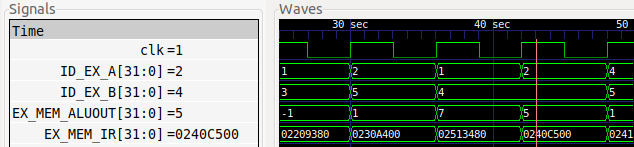

# ASIC_DESIGN
<details>
 <summary><strong>Lab-1</strong></summary>
 
 ### Description
   In this lab we compile a simple C program using GCC and RISCV compliers.
 ### Tasks
1.  Writing a simple C program to calculate sum of n numbers and execute the program using GCC.
2.  Execute the same C program using RISCV compiler and compare the results.
## Procedure
 ### Task-1
1. Create a new file(sum1ton.c) in home directory.(Run the command 'cd' before creating the file to make sure you are in home directory).
2. We use leafpad as texteditor to write the code.
   ### Code
   ```c
   #include <stdio.h>
   int main(){
     int i,sum=0,n=100;
     for(i=1;i<=n;i++){
       sum+=i;
     }
     printf("Sum of numbers from 1 to %d is %d\n",n,sum);
     return 0;
   }
   ```
   ### To compile the code using GCC
   ```
   gcc sum1ton.c
   ```

   ### To Run the code
   ```
   ./a.out
   ```
   ### Output
   
### Task-2 : Compliling and verifying the same C code using RISC-V compiler
  1. Compile the code using RISV using the below command
     ```
     riscv64-unknown-elf-gcc -O1 -mabi=lp64 -march=rv64i -o sum1ton.o sum1ton.c
     ```
  2. To run the code
     ```
     riscv64-unknown-elf-objdump -d sum1ton.o | less
     ```
  3. Output
     
  ### Explanation of the Output:
  - 0000000000010184 is the address where the main function starts.
  - To known the number of instructions it takes to execute we subtract 0000000000010184(which is the next function) from 00000000000101c0 and divide it by 4(Since each instruction takes 4 bytes).
  - In this case it take 15 instructions.
  - We can reduce the number of instructions it takes by compiling the code using the below command.
     ```
     riscv64-unknown-elf-gcc -Ofast -mabi=lp64 -march=rv64i -o sum1ton.o sum1ton.c
     ```
     
    - Run the code using the same code as above.
    - In the above case it is taking only 12 instructions to execute.

</details>


<details>
 <summary><strong>Lab-2</strong></summary>

  ### Description
  Comparing the GCC compiled output with RISCV compiled output
  ### Procedure
  1. Compile the code using the below command.
     ```
     riscv64-unknown-elf-gcc -Ofast -mabi=lp64 -march=rv64i -o sum1ton.o sum1ton.c
     ```
  2. Run the code
     ```
     spike pk sum1ton.o
     ```
  3. Output
     
  ### Debugging the Code
  - We debug the code using the below command
    ```
    spike -d pk sum1ton.o
    ```
  - First run the RISCV code(`riscv64-unknown-elf-objdump -d sum1ton.o | less`).We can get the location of main function from where we can debug the code line by line.
    #### Output
    
    
  - Use the below command to take pc to the main function .(100b0 is the starting point of the main function).
    ```
    until pc 0 100b0
    ```
  - We can know the initial value of a2 before executing the instruction and obsereve the change in the value of a2 after executing the instruction.
  - To know the value of a2 use the below command.Press enter the run the following instructions.
     ```
     reg 0 a2
     ```
     
  - lui - Load Upper immediate.
  - We can observe the value of a2 is changed.
  - Similarily, we can also observe the working of the other RISCV instruction i.e addi
  - To observe the working of addi, first move the pc to 100b8(which means program is executed till the instruction 100b8).Then observe the change in the value of sp(-16 in decimal is 10 in hexadecimal).We can observe the value of sp is decreased by 10.
    
### References
[RISCV-INSTRUCTIONS](https://riscv.org/wp-content/uploads/2017/05/riscv-spec-v2.2.pdf) 
</details>


<details>
 <summary><strong>Lab-3</strong></summary>.

   ## Description
   To identify various RISC-V instruction type (R, I, S, B, U, J) and determine exact 32-bit instruction code in the instruction type format for below RISC-V instructions. 
   ## Theory
   - The RISC-V architecture employs six main instruction formats—R-Type, I-Type, S-Type, B-Type, U-Type, and J-Type—each used for specific operations like arithmetic, logic, immediate value processing, branching, memory access, and jumps respectively.
  - Instruction format for different RISC-V instructions:
  
  

- Instruction set table for predefined values:
  
  

     
      
   ## Instructions
   ```
    ADD r6, r7, r8
    SUB r8, r6, r7
    AND r7, r6, r8
    OR r8, r7, r5
    XOR r8, r6, r4
    SLT r10, r2, r4
    ADDI r12, r3, 5
    SW r3, r1, 4
    SRL r16, r11, r2
    BNE r0, r1, 20
    BEQ r0, r0, 15
    LW r13, r11, 2
    SLL r15, r11, r2
   ```
   ## Detailed Instruction Breakdown

  -  ```ADD r6, r7, r8```
     - **Opcode for ADD**: `0110011`
     - **rd** = `r6` = `00110`
     - **rs1** = `r7` = `00111`
     - **rs2** = `r8` = `01000`
     - **func3** = `000`
     - **func7** = `0000000`
     - **Instruction Type**: R Type
     - **32-bit Instruction**: `0000000_01000_00111_000_00110_0110011`
     - **Hexadecimal representation**: ` 0x00838333`
    
  -  ```SUB r8, r6, r7```
     - **Opcode for SUB**: `0110011`
     - **rd** = `r8` = `01000`
     - **rs1** = `r6` = `00110`
     - **rs2** = `r7` = `00111`
     - **func3** = `000`
     - **func7** = `0100000`
     - **Instruction Type**: R Type
     - **32-bit Instruction**: `0100000_00111_00110_000_01000_0110011`
     - **Hexadecimal representation**: `0x40730433`
    
  - ```AND r7, r6, r8```
    
     - **Opcode for AND**: `0110011`
     - **rd** = `r7` = `00111`
     - **rs1** = `r6` = `00110`
     - **rs2** = `r8` = `01000`
     - **func3** = `111`
     - **func7** = `0000000`
     - **Instruction Type**: R Type
     - **32-bit Instruction**: `0000000_01000_00110_111_00111_0110011`
     - **Hexadecimal representation**: `0x008373B3`
   
  - ```OR r8, r7, r5```
     - **Opcode for OR**: `0110011`
     - **rd** = `r8` = `01000`
     - **rs1** = `r7` = `00111`
     - **rs2** = `r5` = `00101`
     - **func3** = `110`
     - **func7** = `0000000`
     - **Instruction Type**: R Type
     - **32-bit Instruction**: `0000000_00101_00111_110_01000_0110011`
     - **Hexadecimal representation**: `0x0053E433`
   
  - ```XOR r8, r6, r4```
    - **Opcode for XOR**: `0110011`
    - **rd** = `r8` = `01000`
    - **rs1** = `r6` = `00110`
    - **rs2** = `r4` = `00100`
    - **func3** = `100`
    - **func7** = `0000000`
    - **Instruction Type**: R Type
    - **32-bit Instruction**: `0000000_00100_00110_100_01000_0110011`
    - **Hexadecimal representation**: `0x00434433`
   
  -  ```SLT r10, r2, r4```
     - **Opcode for SLT**: `0110011`
     - **rd** = `r10` = `01010`
     - **rs1** = `r2` = `00010`
     - **rs2** = `r4` = `00100`
     - **func3** = `010`
     - **func7** = `0000000`
     - **Instruction Type**: R Type
     - **32-bit Instruction**: `0000000_00100_00010_010_01010_0110011`
     - **Hexadecimal representation**: `0x00412533`
     
  - ```ADDI r12, r3, 5```
   
    - **Opcode for ADDI**: `0010011`
    - **rd** = `r12` = `01100`
    - **rs1** = `r3` = `00011`
    - **imm[11:0]** = `000000000101`
    - **func3** = `000`
    - **Instruction Type**: I Type
    - **32-bit Instruction**: `000000000101_00011_000_01100_0010011`
    - **Hexadecimal representation**: `0x00518613`
   
   - ```SW r3, r1, 4```
   
     - **Opcode for SW**: `0100011`
     - **imm[11:5]** = `0000000`
     - **rs2** = `r3` = `00011`
     - **rs1** = `r1` = `00001`
     - **imm[4:0]** = `00100`
     - **func3** = `010`
     - **Instruction Type**: S Type
     - **32-bit Instruction**: `0000000_00011_00001_010_00100_0100011`
     - **Hexadecimal representation**: `0x0030A223`
   
  - ```SRL r16, r11, r2```
   
    - **Opcode for SRL**: `0110011`
    - **rd** = `r16` = `10000`
    - **rs1** = `r11` = `01011`
    - **rs2** = `r2` = `00010`
    - **func3** = `101`
    - **func7** = `0000000`
    - **Instruction Type**: R Type
    - **32-bit Instruction**: `0000000_00010_01011_101_10000_0110011`
    - **Hexadecimal representation**: `0x0025D833`
   
  - ```BNE r0, r1, 20```
   
    - **Opcode for BNE**: `1100011`
    - **imm[12|10:5]** = `0000010`
    - **rs2** = `r1` = `00001`
    - **rs1** = `r0` = `00000`
    - **imm[4:1|11]** = `10100`
    - **func3** = `001`
    - **Instruction Type**: B Type
    - **32-bit Instruction**: `0000010_00001_00000_001_10100_1100011`
    - **Hexadecimal representation**: `0x04101A63`
   
  - ```BEQ r0, r0, 15```
   
    - **Opcode for BEQ**: `1100011`
    - **imm[12|10:5]** = `0000000`
    - **rs2** = `r0` = `00000`
    - **rs1** = `r0` = `00000`
    - **imm[4:1|11]** = `01111`
    - **func3** = `000`
    - **Instruction Type**: B Type
    - **32-bit Instruction**: `0000000_00000_00000_000_01111_1100011`
    - **Hexadecimal representation**: `0x000007E3`
   
  - ```LW r13, r11, 2```
   
    - **Opcode for LW**: `0000011`
    - **rd** = `r13` = `01101`
    - **rs1** = `r11` = `01011`
    - **imm[11:0]** = `000000000010`
    - **func3** = `010`
    - **Instruction Type**: I Type
    - **32-bit Instruction**: `000000000010_01011_010_01101_0000011`
    - **Hexadecimal representation**: `0x0025A683`
   
  - ```SLL r15, r11, r2```
    
    - **Opcode for SLL**: `0110011`
    - **rd** = `r15` = `01111`
    - **rs1** = `r11` = `01011`
    - **rs2** = `r2` = `00010`
    - **func3** = `001`
    - **func7** = `0000000`
    - **Instruction Type**: R Type
    - **32-bit Instruction**: `0000000_00010_01011_001_01111_0110011`
    - **Hexadecimal representation**: `0x002597B3`
 
 # RISC-V Instruction Summary Table


| Instruction        | Type | 32-bit Binary Representation         | Hexadecimal Representation |
|--------------------|------|--------------------------------------|----------------------------|
| `ADD r6, r7, r8`   | R    | `0000000_01000_00111_000_00110_0110011` | `0x00838333` |
| `SUB r8, r6, r7`   | R    | `0100000_00111_00110_000_01000_0110011` | `0x40730433` |
| `AND r7, r6, r8`   | R    | `0000000_01000_00110_111_00111_0110011` | `0x008373B3` |
| `OR r8, r7, r5`    | R    | `0000000_00101_00111_110_01000_0110011` | `0x0053E433` |
| `XOR r8, r6, r4`   | R    | `0000000_00100_00110_100_01000_0110011` | `0x00434433` |
| `SLT r10, r2, r4`  | R    | `0000000_00100_00010_010_01010_0110011` | `0x00412533` |
| `ADDI r12, r3, 5`  | I    | `000000000101_00011_000_01100_0010011` | `0x00518613` |
| `SW r3, r1, 4`     | S    | `0000000_00011_00001_010_00100_0100011` | `0x0030A223` |
| `SRL r16, r11, r2` | R    | `0000000_00010_01011_101_10000_0110011` | `0x0025D833` |
| `BNE r0, r1, 20`   | B    | `0000010_00001_00000_001_10100_1100011` | `0x04101A63` |
| `BEQ r0, r0, 15`   | B    | `0000000_00000_00000_000_01111_1100011` | `0x000007E3` |
| `LW r13, r11, 2`   | I    | `000000000010_01011_010_01101_0000011` | `0x0025A683` |
| `SLL r15, r11, r2` | R    | `0000000_00010_01011_001_01111_0110011` | `0x002597B3` |

</details>

<details>
<summary><strong>Lab-4</strong></summary>
 
 ## Description
 Functional simulation experiment
 ## Standard RISCV ISA AND Hardcoded ISA(based on given verilog code)
 - In the Verilog code, each instruction type is assigned a unique opcode, and the func3 and func7 fields have distinct values compared to the standard RISC-V values. The func7 field is primarily used to differentiate immediate operations from other arithmetic functions; if it’s not serving this purpose, func7 is set to b'0 in the Verilog implementation.
 - Below is the table with hardcoded 32-bit code using func3,func7 and opcodes from the given verilog code.

| S.No | Instruction        | Hardcoded 32-bit Pattern             | Hardcoded Hexadecimal Pattern | 32-bit Pattern                        | Hexadecimal Pattern |
|------|--------------------|--------------------------------------|--------------------------------|---------------------------------------|---------------------|
| 1    | ADD r6,r7,r8        | 0000001_01000_00111_000_00110_0000000 | 0x02838300                     |0000000_01000_00111_000_00110_0110011 | 0x00838333          |
| 2    | SUB r8,r6,r7        | 0000001_00111_00110_001_01000_0000000 | 0x02731400                    |0100000_00111_00110_000_01000_0110011 | 0x40730433         |
| 3    | AND r7, r6, r8      | 0000001_01000_00110_010_00111_0000000 | 0x02832380                     |0000000_01000_00110_111_00111_0110011 | 0x008373B3          |
| 4    | OR r8, r7, r5       | 0000001_00101_00111_011_01000_0000000 | 0x0253B400                     | 0000000_00101_00111_110_01000_0110011 | 0x0053E433          |
| 5    | XOR r8, r6, r4      | 0000001_00100_00110_100_01000_0000000 | 0x02434400                     | 0000000_00100_00110_100_01000_0110011 | 0x00434433          |
| 6    | SLT r10, r2, r4     | 0000001_00100_00010_101_01010_0000000 | 0x02415500                     | 0000000_00100_00010_010_01010_0110011 | 0x00412533          |
| 7    | ADDI r12, r3, 5     | 000000000101_00011_000_01100_0000000 | 0x00518600                     | 0000000_000101_00011_000_01100_0010011 | 0x00518613         |
| 8    | SW r3, r1, 4        | 0000000_00001_00011_001_00100_0000001 | 0x00119201                     | 0000000_00001_00011_010_00100_0100011 | 0x0030A223          |
| 9    | SRL r16, r11, 2      | 0000000_00010_01011_001_10000_0000011 | 0x00259803                      | 0000000_00010_01011_101_10000_0110011 | 0x0025D833          |
| 10   | BEQ r0, r0, 15    | 0_000000_01111_00000_000_0000_0_0000010 | 	0X00f00002                     | 0000000_00000_00000_000_01111_1100011 | 0x000007E3          |
| 11   | LW r13, r11, 2     |  000000000010_01011_000_01101_0000001|   	0x00258681                       |0000000_00010_01011_010_01101_0000011 |0x0025A683 |


## Instructions provided in the verilog code

| S. No. | Operation          | Standard RISC-V ISA | Hardcoded ISA |
|--------|--------------------|---------------------|---------------|
| 1      | ADD R6, R1, R2      | 0x00110333          | 0x02208300    |
| 2      | SUB R7, R1, R2      | 0x402083b3          | 0x02209380    |
| 3      | AND R8, R1, R3      | 0x0030f433          | 0x0230a400    |
| 4      | OR R9, R2, R5       | 0x005164b3          | 0x02513480    |
| 5      | XOR R10, R1, R4     | 0x0040c533          | 0x0240c500    |
| 6      | SLT R11, R2, R4     | 0x0045a0b3          | 0x02415580    |
| 7      | ADDI R12, R4, 5     | 0x004120b3          | 0x00520600    |
| 8      | BEQ R0, R0, 15      | 0x00000f63          | 0x00f00002    |
| 9      | SW R3, R1, 2        | 0x0030a123          | 0x00209181    |
| 10     | LW R13, R1, 2       | 0x0020a683          | 0x00208681    |
| 11     | BEQ R0, R0, 15      | 0x00000f63          | 0x00f00002    |
| 12     | ADD R14, R2, R2     | 0x00210733          | 0x00210700    |

## Below are the output waveforms for each instruction from testbench.
  ```1.  ADD r6, r1, r2 ```
   
   


   ```2. SUB r7, r1, r2 ```

   


   ```3.  AND r8, r1, r3 ```

   


   ```4. OR r9, r2, r5 ```

   


   ```5. XOR r10, r1, r4 ```

   

  ```6. SLT r11, r2, r4 ```

   


   ```7. ADDI r12, r4, 5 ```

   


   ```8. SW r3, r1, 2 ```

   


   ```9. LW r0, r0, 15 ```

   


   ```10. BEQ r0, r0, 15 ```

   


   ```11. ADD r14, r2, r2```
   
   

   The final output plot is :

   


</details>
 
<details>
 <summary><strong>Lab-5</strong></summary>
</details>

   
   
